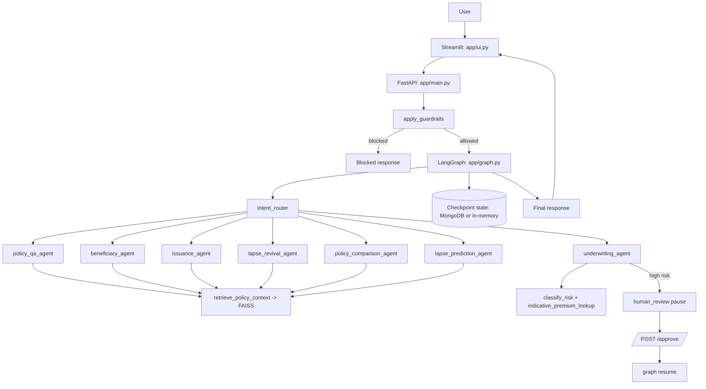

# Life-Insurance-AI — Complete Technical Documentation

This document is a full technical reference for the repository. It explains:
- every file and why it exists,
- every function/class and what it does,
- end-to-end runtime behavior,
- key configuration and design decisions.

The goal is implementation transparency: a reader should be able to understand the complete project behavior from this document.

---

## 1) Repository-Wide Runtime Flow

---

## 2) Retrieval, Search, and Indexing (Exact Behavior)

### 2.1 Search mechanism
- Retrieval uses **FAISS vector similarity search**.
- BM25 is **not** implemented in the current code.
- Retrieval entrypoint: `retrieve_policy_context(query, k=3)` in `app/tools/rag.py`.

### 2.2 Document ingestion and chunking
- Source files: all `*.pdf` under `app/data/`.
- Loader: `PyPDFLoader`.
- Splitter: `RecursiveCharacterTextSplitter`.
- Config:
  - `chunk_size = 1000`
  - `chunk_overlap = 200`

### 2.3 Embedding provider selection
Embedding model source is selected from environment variables:
1. `GROQ_API_KEY` → HuggingFace embeddings (`all-MiniLM-L6-v2`)
2. `GOOGLE_API_KEY` or `GEMINI_API_KEY` → Google `gemini-embedding-001`
3. `OPENAI_API_KEY` → OpenAI embeddings

### 2.4 Index compatibility and rebuild
- Index path: `app/data/faiss_index/`
- Marker file: `.provider`
- Behavior:
  - If index exists and provider matches marker: reuse.
  - If provider changed or marker missing: rebuild index.

### 2.5 Retrieval output formatting
For each retrieved chunk, context is rendered as:
- source filename,
- page number,
- chunk content.

This is why agent prompts can request citation-style responses.

---

## 3) Underwriting CSV Logic (Exact Behavior)

File: `app/tools/csv_lookup.py`

### 3.1 `classify_risk(disclosures)`
Purpose:
- Convert free-text health/lifestyle disclosures into project risk tiers.

How it works:
1. Empty disclosures → `standard`.
2. Loads `RiskScore_Classification_Table.csv`.
3. Normalizes disclosures to lowercase.
4. Applies smoker heuristic (`smoker` without `non-smoker` context).
5. Performs CSV `specific_condition` matching via string contains.
6. Maps CSV class text to project tiers:
   - severe/postpone/decline patterns → `declined`
   - class III/IV patterns → `high`
   - class I/II/smoker patterns → `substandard`
   - else `standard`
7. Returns highest-severity tier found.

Why it exists:
- deterministic risk support prior to any human underwriter intervention.

### 3.2 `indicative_premium_lookup(age, cover_amount, term_years, risk_tier)`
Purpose:
- Generate indicative monthly premium from reference table with controlled fallbacks.

How it works:
1. Loads `PremiumRate_ReferenceTable.csv`.
2. Coerces age/cover/term to ints.
3. Finds nearest available values for age, term, and cover.
4. Filters rows by nearest values + default gender (`Male`).
5. Selects premium row by risk tier strategy:
   - `high` → highest premium row
   - `substandard` → Class I preferred; otherwise high premium fallback
   - `standard` → Standard class preferred; otherwise lowest available
6. If no table row exists, applies fallback formula.
7. Returns:
   - `monthly_estimate`
   - `disclaimer` indicating indicative-only output.

Why it exists:
- transparent, reproducible underwriting estimate logic.

---

## 4) API Layer (Every Endpoint)

File: `app/main.py`

### Global setup responsibilities
- Loads environment via `dotenv`.
- Initializes FastAPI app.
- Builds compiled LangGraph once (`compiled_graph = build_graph()`).
- Initializes optional MongoDB session store if `MONGODB_URI` present.
- Loads active sessions into `_active_sessions`.

### Functions/classes and purpose

1. `load_sessions()`
- Reads session metadata from MongoDB (if configured) or local JSON file fallback.
- Exists to persist `/sessions` sidebar information.

2. `save_sessions(sessions)`
- Writes session metadata to MongoDB or local JSON.
- Exists to keep active session list durable.

3. `health()` (`GET /health`)
- Liveness endpoint.

4. `chat(req: ChatRequest)` (`POST /chat`)
- Non-streaming chat flow:
  1) guardrail check,
  2) paused-state check,
  3) graph invoke,
  4) pause annotation,
  5) conversation history append,
  6) structured response output.

5. `chat_stream(req: ChatRequest)` (`POST /chat/stream`)
- SSE streaming flow:
  - emits token events during `astream_events`,
  - emits metadata,
  - handles blocked/paused short-circuit paths,
  - handles cached-response fallback when no stream chunks emitted,
  - persists conversation history after completion.

6. `ApprovalRequest` (Pydantic)
- Defines `/approve` request payload (`session_id`, `approved`).

7. `approve(req: ApprovalRequest)` (`POST /approve`)
- Validates pending human review,
- updates approval-related state,
- resumes graph execution via `ainvoke(None, config=...)`.

8. `get_state(session_id)` (`GET /state/{session_id}`)
- Returns checkpoint state plus computed `is_paused` flag.

9. `list_sessions()` (`GET /sessions`)
- Lists active session metadata.
- Concurrently resolves each session state via `asyncio.gather`.
- Includes paused flag, intent, and node path trace.

10. `delete_session(session_id)` (`DELETE /sessions/{session_id}`)
- Removes session from persistence and in-memory active tracker.

---

## 5) Workflow Layer (Every Node, Route, Helper)

File: `app/graph.py`

### 5.1 Core setup
- Enables in-memory LLM cache (`InMemoryCache`) to reuse duplicate responses.
- `get_llm()` selects chat model provider (Groq, Gemini, OpenAI).

### 5.2 Structured models
1. `IntentClassification`
- schema for strict routing labels.
2. `ApplicantDataExtract`
- schema for underwriting field extraction.

### 5.3 Shared helper
- `format_history(history)`
  - formats recent conversation to prompt text.

### 5.4 Nodes
1. `intent_router(state)`
- classifies into one of 7 intent labels.
- has keyword fallback route logic on model failure.

2. `underwriting_agent(state)`
- extracts applicant details,
- merges with existing state data,
- computes risk tier and premium estimate,
- flags `requires_human_review` for elevated risk,
- creates natural-language indicative response.

3. `policy_qa_agent(state)`
- builds retrieval query,
- retrieves policy context from FAISS,
- prompts model for citation-oriented answer.

4. `beneficiary_agent(state)`
- retrieval with beneficiary-oriented context prefix,
- returns nominee/share guidance response.

5. `issuance_agent(state)`
- retrieval with issuance/documents context prefix,
- returns issuance process response.

6. `lapse_revival_agent(state)`
- retrieval with lapse/revival context prefix,
- returns grace/lapse/reinstatement guidance.

7. `policy_comparison_agent(state)`
- retrieval + instruction to generate structured comparison table.

8. `lapse_prediction_agent(state)`
- retrieval + mocked payment history text,
- returns lapse-risk guidance.

9. `human_review(state)`
- appends explicit pause message in response payload.

### 5.5 Streaming helper
- `stream_agent_response(state, agent_name)`
  - builds agent-specific prompt and yields token chunks via `llm.astream`.

### 5.6 Route functions
- `route_from_intent(state)` → maps `intent` to node id.
- `route_from_underwriting(state)` → `human_review` or `end`.

### 5.7 Graph construction
- `build_graph()`:
  - registers nodes,
  - defines start/conditional/end edges,
  - configures checkpoint saver:
    - MongoDB saver when `MONGODB_URI` exists,
    - MemorySaver fallback otherwise,
  - compiles graph.

---

## 6) Data and Schema Layer

### File: `app/models.py`

1. `ChatRequest`
- API input schema: `session_id`, `message`.

2. `ChatResponse`
- API output schema: `session_id`, `node_path`, `response`, `state`.

3. `add_and_truncate_history(left, right)`
- reducer for conversation history:
  - appends both sides,
  - keeps only last 10 messages.

4. `CopilotState`
- typed state contract for LangGraph.
- includes routing, output, underwriting, and trace fields.

Why file exists:
- centralized, typed contract between API layer and graph layer.

---

## 7) Safety Layer

### File: `app/guards.py`

1. `GuardResult`
- simple dataclass for block decision and reason.

2. `BLOCK_PATTERNS`
- direct phrase blocks for prohibited insurance/medical outputs.

3. `INJECTION_PATTERNS`
- regex patterns for common prompt-injection attempts.

4. `PHI_PATTERNS`
- regex patterns for sensitive personal data detection.

5. `apply_guardrails(text)`
- executes block checks in order:
  1) direct patterns,
  2) injection patterns,
  3) sensitive data patterns,
- returns block result used by `/chat` and `/chat/stream`.

Why file exists:
- deterministic pre-LLM policy enforcement.

#### 7.1 Guardrail caching and behavior

- Guardrail decisions are cached using the `guardrail_cache` instance in `app/cache.py`.
- `guardrail_cache` is a `TTLCache(ttl_seconds=1800, max_size=512)`, which caches the `GuardResult` for 30 minutes by default. This is safe because the guard checks are deterministic for the same input and caching reduces duplicate computation on repeated inputs.
- The guard logic is intentionally local and deterministic (string matching and regex). This design avoids introducing third-party runtime dependencies and keeps refusal responses auditable and transparent.

---

---

## 8) UI Layer

### File: `app/ui.py`

Key responsibilities:
- `app/cache.py` — central in-memory cache utilities. Contains a lightweight `TTLCache` class, a few named cache instances, and `read_csv_cached` (an `lru_cache`) for static CSV reads.
- `app/graph.py` — sets a LangChain LLM cache via `set_llm_cache(InMemoryCache())`. This is an in-process LLM request deduplication cache.
- `app/guards.py` — uses `guardrail_cache` from `app/cache.py` to memoize guard decisions.

- initialize Streamlit page/session state,
- Zero external dependencies (no Redis/Memcached), keeping the runtime simple and portable.
- Microsecond lookups avoid network hops in single-process deployments (Streamlit + uvicorn). This is important for UI responsiveness.
- TTLs prevent stale data (especially for RAG queries) while still enabling huge reductions in repeated work.

- call backend chat endpoints,
- `InMemoryCache()` reduces duplicate expensive LLM API calls during rapid development or when clients re-send identical prompts.
- It is process-local; for multi-worker setups, replace with a Redis-backed cache or a langchain-supported distributed cache.

- render streamed responses,
- If you deploy with multiple uvicorn workers, multiple containers, or horizontal scaling behind a load balancer, in-process caches will not be shared and may increase overall API cost instead of reducing it. In that case:
  1. Replace `TTLCache` instances with a Redis-backed TTL cache (e.g., `redis-py` + small wrapper implementing `get/set/invalidate`).
  2. Use a shared LLM request cache supported by your LLM client or a Redis-backed `langchain` cache.

- show state metrics (risk tier, applicant data, node path),
- Keep `guardrail_cache` enabled — it's cheap and makes guard checks performant.
- Keep `read_csv_cached` for CSV reads — these files are static and safe to cache with `lru_cache`.
- For production scale (multi-worker), prioritize Redis for:
  - `rag_cache` (share retrieval results across workers)
  - `llm` cache (deduplicate at cluster level)
  - `sessions` storage is already supported by MongoDB in `app/graph.py`

Files to inspect:
- `app/cache.py` — TTLCache, cache instances, `read_csv_cached`
- `app/graph.py` — `set_llm_cache(InMemoryCache())` and in-memory LLM cache print
- `app/guards.py` — guard logic and cache usage
- provide human review approve/reject controls,
- display active sessions and allow switching/deletion.

Functions:
1. `fetch_state()`
- loads backend session checkpoint state.

2. `stream_chat(message)`
- consumes SSE stream from `/chat/stream`.
- fallback to `/chat` when streaming fails.

Why file exists:
- operator/user interface for interacting with and supervising the workflow.

---

## 9) Tooling and Evaluation

### `evaluation/run_eval.py`
Functions:
1. `load_test_set()`
2. `query_copilot(question, session_id='eval-session')`
3. `run_evaluation()`

Behavior:
- executes evaluation question set,
- checks route correctness and keyword coverage,
- reports citation-rate signals,
- optionally computes DeepEval metrics when library is installed,
- writes output to `evaluation/eval_results.json`.

### `evaluation/test_set.json`
- scenario dataset used for routine evaluation runs.

### `evaluation/questions_all_routes.json`
- prompts designed to exercise all route branches.

### `evaluation/eval_results.json`
- saved report artifact from prior runs.

---

## 10) Complete File Inventory (Purpose of Each File)

### Root
- `README.md`: project overview, setup, architecture summary.
- `PROJECT_FULL_DOCUMENTATION.md`: existing broad technical guide.
- `problem-statement.txt`: original assignment/problem definition.
- `capstone_project_03_life_insurance_problem.pdf`: source problem statement.
- `pdf_text.txt`: extracted text artifact.
- `requirements.txt`: dependency list.
- `Dockerfile`: container build steps.
- `docker-compose.yml`: local multi-process orchestration.
- `start.sh`: starts backend and frontend processes.

### Application
- `app/main.py`: API endpoints, session tracking, graph invocation/resume.
- `app/graph.py`: full orchestration graph and agent/node logic.
- `app/models.py`: typed schemas and reducer contracts.
- `app/guards.py`: safety checks and refusal logic.
- `app/ui.py`: Streamlit client interface.
- `app/tools/rag.py`: ingestion, embedding selection, FAISS retrieval.
- `app/tools/csv_lookup.py`: deterministic underwriting helpers.

### Data
- `app/data/*.pdf`: insurance policy knowledge corpus.
- `app/data/RiskScore_Classification_Table.csv`: risk mapping data.
- `app/data/PremiumRate_ReferenceTable.csv`: premium lookup data.
- `app/data/faiss_index/index.faiss`: FAISS vector index binary.
- `app/data/faiss_index/index.pkl`: FAISS metadata sidecar.
- `app/data/checkpoints.sqlite*`: local checkpoint artifacts.
- `app/data/sessions.json`: local session metadata fallback.

### Evaluation
- `evaluation/run_eval.py`: evaluator execution script.
- `evaluation/test_set.json`: default eval dataset.
- `evaluation/questions_all_routes.json`: route-coverage set.
- `evaluation/eval_results.json`: saved evaluator output.

---

## 11) Why Each Major Component Exists

1. **FastAPI layer**
- stable API boundary for UI and external clients.

2. **LangGraph layer**
- explicit multi-route orchestration + pause/resume control.

3. **RAG/FAISS layer**
- document-grounded answers rather than pure memory generation.

4. **CSV deterministic layer**
- transparent, repeatable risk/premium calculations.

5. **Guardrails layer**
- policy/safety enforcement before costly model execution.

6. **Checkpoint/state layer**
- persistence and continuity across multi-turn sessions.

7. **Streamlit layer**
- operational visualization + approval controls + session navigation.

---

## 12) Limitations and Improvement Opportunities

- Lapse prediction currently uses mocked payment history text; integrate actual payment timeline source.
- Premium lookup currently defaults to male when gender is unknown.
- Retrieval may benefit from reranking/hybrid methods if precision needs increase.
- In-memory checkpoint fallback loses state on restart when MongoDB is not configured.

---

## 13) Coverage Confirmation

This document covers:
- every file category in the repository,
- every function/class used in runtime modules,
- every API endpoint and route,
- retrieval/indexing/chunking details,
- CSV underwriting logic,
- state, safety, and human-review behavior,
- purpose and existence rationale for all major components.
