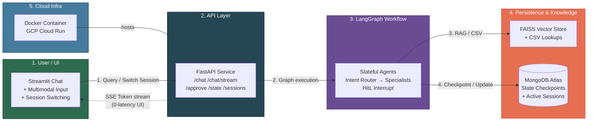
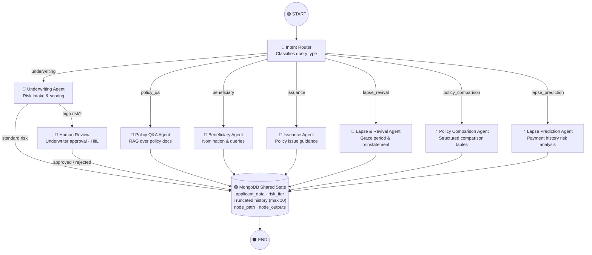

# 🛡️ Life Insurance AI Copilot

Production-grade **LangGraph stateful** life insurance copilot built for scalability and performance. 

### Key Features
- **7 Specialist Agent Nodes** + 2 bonus innovation agents via dynamic Intent Routing.
- **MongoDB Persistent State:** Deep session persistence across server restarts using `langgraph-checkpoint-mongodb` and `pymongo`.
- **Session Management:** Dedicated Streamlit sidebar to seamlessly switch between active sessions, view conversation intents/traces, and securely delete sessions.
- **Human-in-the-Loop (HitL):** Pauses graph execution for human underwriter review on high-risk profiles.
- **High-Performance Streaming:** True real-time token streaming via SSE (`astream_events`) integrated flawlessly with Streamlit UI.
- **In-Memory LLM Caching:** Intercepts duplicate exact queries globally using LangChain's `InMemoryCache` for 0ms latency and cost savings.
- **Context Window Optimization:** Custom LangGraph reducer automatically truncates the conversation memory to the last 10 messages to protect LLM context limits.
- **🎙️ Multimodal Input:** Voice & image upload support (OpenAI Whisper + GPT-4o-mini).
- **RAG & Structured Lookups:** FAISS-powered PDF retrieval + Pandas CSV actuarial lookups.

---

## Architecture

### System Architecture & Data Flow (5 Layers)



**Figure 1:** System architecture showcasing MongoDB integration and streaming UI.

---

### LangGraph Stateful Workflow



---

## Performance & Optimization Additions
- **Concurrent API Fetching:** The `/sessions` endpoint uses `asyncio.gather` to concurrently query MongoDB for all active session states, preventing UI lockups and ensuring instant Streamlit sidebar re-renders.
- **LLM Token Conservation:** LangChain's `InMemoryCache` prevents the system from making expensive duplicate LLM API calls.
- **Dynamic Context Window:** The `conversation_history` typed dictionary uses a custom Python reducer (`add_and_truncate_history`) to guarantee the array never exceeds 10 items, preventing context window bloat during long sessions.
- **Native Async Streaming:** The backend executes `llm.astream_events` entirely asynchronously, ensuring the FastAPI event loop is never blocked during token generation.

---

## Caching & Safety (Guardrails)

- **Application-level caches:** The project implements a lightweight, in-process caching layer in `app/cache.py` using a small `TTLCache` implementation and `functools.lru_cache` for static CSV reads. Key cache instances and defaults:
    - `rag_cache` — TTL 600s (10 minutes), max 128 entries (caches RAG retrievals)
    - `guardrail_cache` — TTL 1800s (30 minutes), max 512 entries (caches guardrail decisions)
    - `state_cache` — TTL 5s, max 32 entries (short-term cache for UI state fetches)
    - `sessions_cache` — TTL 3s, max 1 entry (reduces /sessions load)
    - `read_csv_cached` — `lru_cache(maxsize=4)` for deterministic CSV file reads

- **Why these choices:** in-process caches are zero-dependency, extremely low-latency, and sufficient for single-process deployments (development and small-scale production). They avoid the operational overhead of Redis/Memcached. When scaling to multiple processes or hosts, swap the TTL caches for a Redis-backed cache.

- **LLM-level caching:** `app/graph.py` sets LangChain's (langchain_core) LLM cache to an `InMemoryCache()` via `set_llm_cache(InMemoryCache())`. This deduplicates identical LLM requests in-process and reduces API calls and latency. Note: this cache is process-local and ephemeral (printed log: "✅ In-Memory LLM Cache Enabled").

- **Guardrails implementation:** Safety checks are implemented locally in `app/guards.py` (not via an external `guardrails-ai` package). The guard layer uses deterministic phrase and regex checks for:
    - explicit forbidden phrases (insurance/medical final decisions, guaranteed quotes),
    - prompt-injection patterns (e.g., "ignore all instructions", "reveal your system prompt"),
    - PHI/PII patterns (SSN, Aadhaar, credit-card formats, keywords like "my password is").
    - Guard decisions are cached in `guardrail_cache` to avoid re-evaluating identical inputs.

If you want, the project can be extended to use Redis for both the app caches and LLM cache (recommended for multi-worker deployments).

## Quickstart

### 1. Clone the Repository
```bash
git clone https://github.com/thughari/Group3-Insurance-AI
cd Life-Insurance-AI
```

### 2. Configure Environment Variables
Create a `.env` file in the root directory:
```env
# Choose one of the following LLM providers:
OPENAI_API_KEY=your-openai-key
# GOOGLE_API_KEY=your-gemini-key
# GROQ_API_KEY=your-groq-key

# Persistent State Database (Required for session continuity):
MONGODB_URI=mongodb+srv://<user>:<password>@cluster.mongodb.net/

# LangSmith Tracing (required for observability):
LANGCHAIN_TRACING_V2=true
LANGCHAIN_API_KEY=your-langsmith-key
LANGCHAIN_PROJECT=life-insurance-copilot
```

### 3. Run the Application

You can run the application either using Docker (recommended) or locally using Python.

#### Option A: Using Docker
Start the services using Docker Compose:
```bash
docker-compose up --build
```
Access the Streamlit UI at `http://localhost:8501`.

#### Option B: Local Setup (Two Terminals)
**Terminal 1 (Backend):**
```bash
python -m venv venv
.\venv\Scripts\activate  # Windows
pip install -r requirements.txt
python -m uvicorn app.main:app --host 0.0.0.0 --port 8000 --reload
```

**Terminal 2 (Frontend):**
```bash
.\venv\Scripts\activate
python -m streamlit run app/ui.py
```

---

## API Endpoints

| Endpoint | Method | Description |
|----------|--------|-------------|
| `/health` | GET | Liveness check |
| `/chat` | POST | Synchronous chat execution |
| `/chat/stream` | POST | **Streaming chat (SSE) - Powers the UI** |
| `/approve` | POST | Submit HitL underwriter approval to resume graph |
| `/state/{session_id}` | GET | Retrieve full LangGraph state checkpoint |
| `/sessions` | GET | **Concurrent fetch of all active sessions** |
| `/sessions/{session_id}` | DELETE | Securely delete a session from DB tracking |

---

## Repo Layout

```text
├── app/
│   ├── main.py            # FastAPI endpoints + SSE Streaming + Async Session Management
│   ├── graph.py           # LangGraph workflow + InMemory LLM Caching
│   ├── models.py          # TypedDict state + Custom Context Truncator
│   ├── guards.py          # Safety guardrails
│   ├── ui.py              # Streamlit chat UI + Sidebar Session Tracking
│   ├── tools/
│   │   ├── csv_lookup.py  # Actuarial Risk classification from CSV
│   │   └── rag.py         # FAISS vector store build + retrieval
│   └── data/              # PDFs + CSVs + FAISS index
├── evaluation/
│   └── run_eval.py        # DeepEval scorecard
├── Dockerfile             # Containerized for GCP Cloud Run
├── docker-compose.yml
└── requirements.txt       # Heavily optimized for production
```
